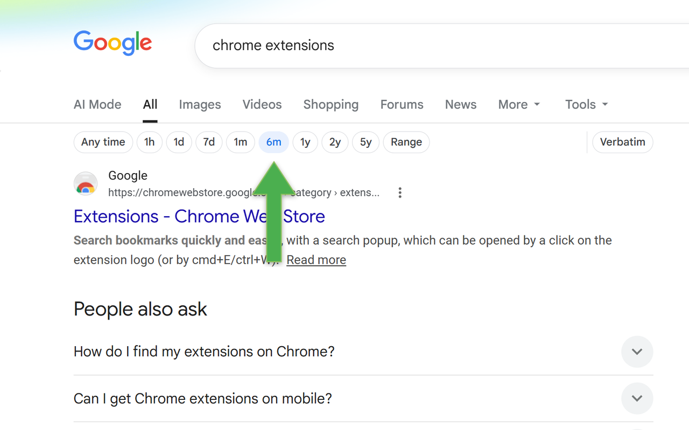

# Search Date Bar

A Chrome extension that puts Google's date filter (Past hour, Past day, Past week...) in a single row right under the search box, instead of buried in the Tools dropdown — plus ranges Google doesn't offer at all (6 months, 2 years, 5 years) and a custom date-range picker.

## Install

[Chrome Web Store](https://chromewebstore.google.com/detail/search-date-bar/mchncdgncchoolmnjicpddhkmgebjopg)

## Why

Google's own date filter takes two clicks to reach (Tools → Any time) and tops out at "Past year." This puts every range one click away, adds 6 months / 2 years / 5 years, and adds a custom range with a real date picker for anything else.

## Features

- One-click ranges: Any time, 1h, 1d, 7d, 1m, 6m, 1y, 2y, 5y
- Custom date range, with a native date picker
- Verbatim toggle — exact words, no spelling correction or synonyms
- Matches Google's own light/dark theme automatically
- Zero layout shift — the bar never pushes the page around as it loads
- Keyboard accessible
- Works across Google's ~190 country domains

## License

MIT — see [LICENSE](LICENSE)
