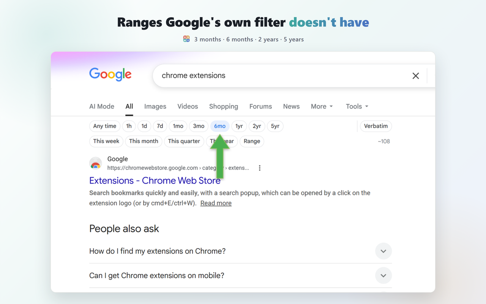

# Google Search by Date – Date Filter Bar with Custom Ranges

A Chrome extension that puts Google's date filter (Past hour, Past day, Past week...) right under the search box, instead of buried in the Tools dropdown — plus ranges Google doesn't offer at all (3/6 months, 2/5 years), calendar-aligned presets (this week/month/quarter/year), and a custom date-range picker.

## Install

[Chrome Web Store](https://chromewebstore.google.com/detail/search-date-bar/mchncdgncchoolmnjicpddhkmgebjopg)

## Why

Google's own date filter takes two clicks to reach (Tools → Any time) and tops out at "Past year." This puts every range one click away, adds 6 months / 2 years / 5 years, and adds a custom range with a real date picker for anything else.

## Features

- One-click ranges: Any time, 1h, 1d, 7d, 1mo, 3mo, 6mo, 1yr, 2yr, 5yr
- Calendar-aligned presets too: This week, This month, This quarter, This year
- Works on Images, Videos, News, Short videos, and Books, not just the main results page
- Custom date range — opens Google's own native date-range picker
- Live result count — a compact "~151M" readout that drops as you narrow the range, so you can see the filter working
- Verbatim toggle — exact words, no spelling correction or synonyms
- Matches Google's own light/dark theme automatically
- Zero layout shift — the bar never pushes content down as it loads
- Keyboard accessible
- Works across Google's ~190 country domains

## License

MIT — see [LICENSE](LICENSE)
